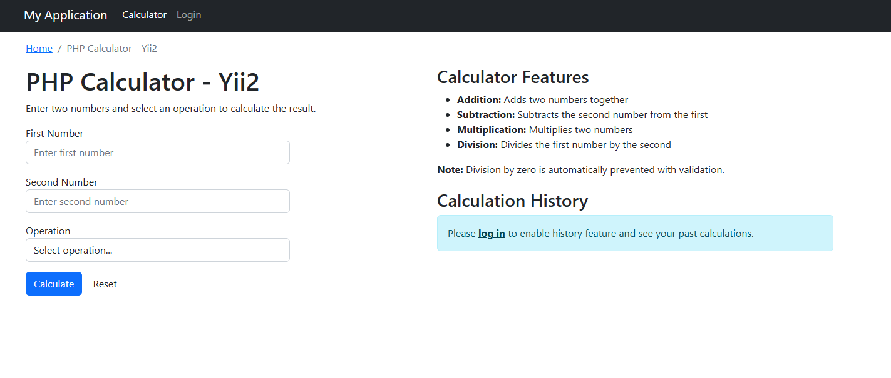
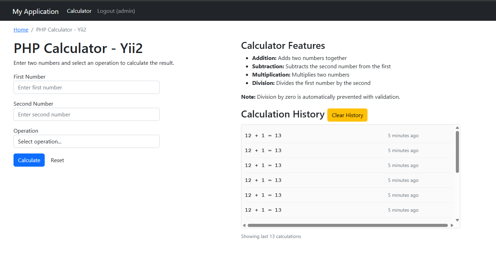

# PHP Calculator with History - Yii2

A simple calculator web application built with the Yii2 PHP framework that supports basic arithmetic operations and maintains calculation history for logged-in users.

## Features

✅ **Basic Calculator Operations**
- Addition, Subtraction, Multiplication, Division
- Input validation and error handling
- Division by zero protection

✅ **User Authentication**
- Login/Logout functionality
- Session management

✅ **Calculation History**
- Saves calculation history for logged-in users
- Displays last 15 calculations with timestamps
- Clear history functionality
- File-based storage using SQLite database

✅ **Responsive Design**
- Bootstrap-based UI
- Mobile-friendly interface

## Requirements

- PHP 8.0 or higher
- SQLite PDO extension enabled
- Composer

## Installation

1. **Clone the repository**
   ```bash
   git clone https://github.com/yourusername/calculator-yii2.git
   cd calculator-yii2
   ```

2. **Install dependencies**
   ```bash
   composer install
   ```

3. **Configure database**
   ```bash
   cp config/db.sample.php config/db.php
   ```

4. **Run migrations**
   ```bash
   php yii migrate
   ```

5. **Start the development server**
   ```bash
   php yii serve
   ```

6. **Access the application**
   Open your browser and go to `http://localhost:8080`

## Default Login Credentials

- **Username:** `admin`
- **Password:** `admin`

Or:

- **Username:** `demo`
- **Password:** `demo`

## Usage

1. **Guest Users**: Can use the calculator but history is not saved
2. **Logged-in Users**: Can use the calculator and view their calculation history
3. **History Features**: View past calculations, clear history, relative timestamps

## Project Structure

```
calculator-yii2/
├── controllers/         # Application controllers
├── models/             # Data models and forms
├── views/              # View templates
├── config/             # Configuration files
├── migrations/         # Database migrations
├── web/                # Web accessible files
└── vendor/             # Composer dependencies
```

## Technologies Used

- **Framework:** Yii2 PHP Framework
- **Database:** SQLite with PDO
- **Frontend:** Bootstrap, HTML5, CSS3
- **Authentication:** Yii2 built-in user management

## Contributing

1. Fork the repository
2. Create a feature branch
3. Commit your changes
4. Push to the branch
5. Create a Pull Request

## License

This project is open source and available under the [MIT License](LICENSE).

## Screenshots

### Calculator Interface


### History Feature
